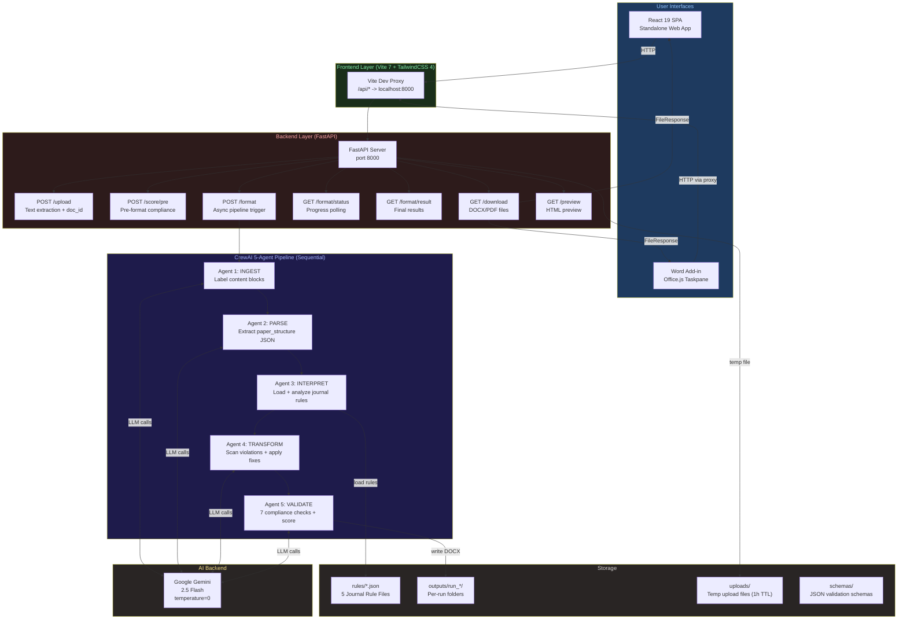
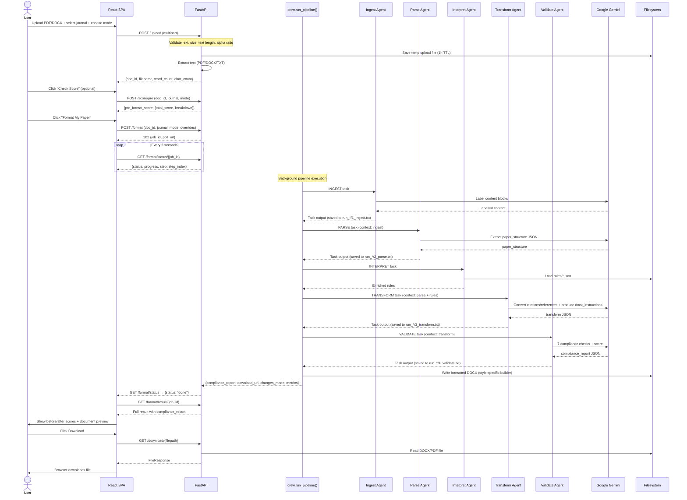
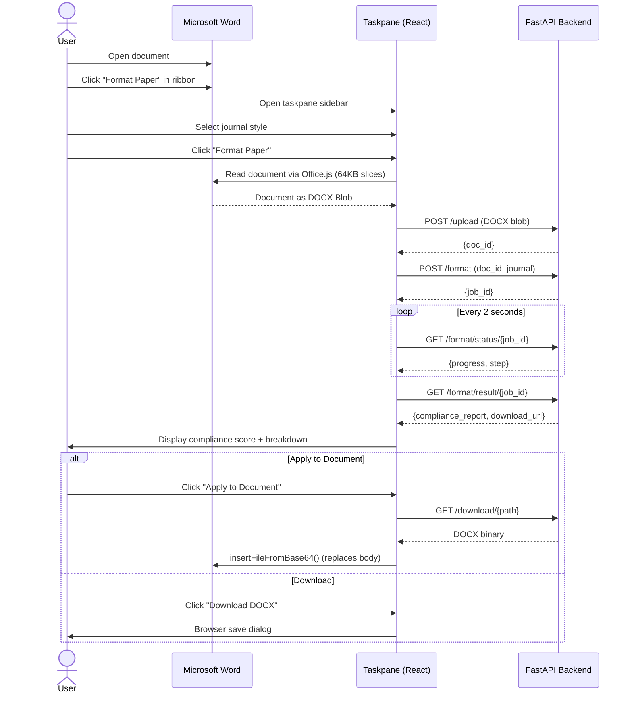
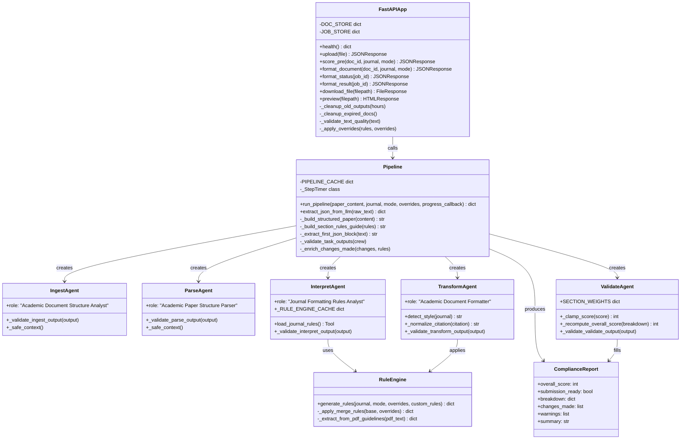
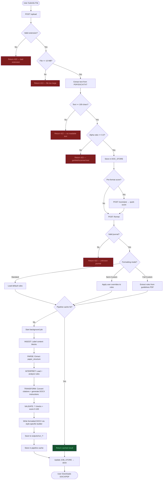
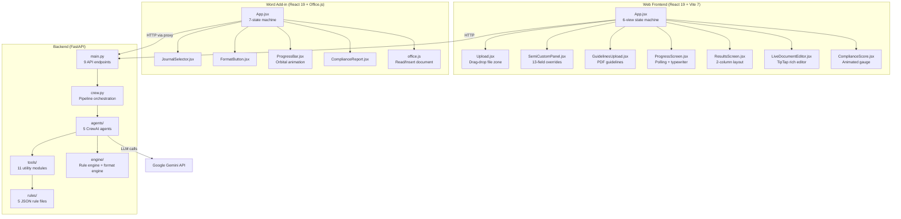

# Agent Paperpal

> Autonomous manuscript formatting system built for HackaMined 2026 — Cactus Communications (Paperpal by Editage) track.

Agent Paperpal is a full-stack AI application that accepts a research paper (PDF or DOCX) and a target journal style, then autonomously detects every formatting violation, applies corrections, generates a formatted DOCX output, and produces a scored compliance report — all powered by a 5-agent CrewAI pipeline backed by Google Gemini 2.5 Flash. Available as both a standalone web app and a Microsoft Word Add-in.

---

## Table of Contents

- [Project Overview](#project-overview)
- [High-Level Architecture](#high-level-architecture)
- [System Architecture](#system-architecture)
- [Technology Stack](#technology-stack)
- [Directory Structure](#directory-structure)
- [Application Workflow](#application-workflow)
- [UML Diagrams](#uml-diagrams)
- [API Documentation](#api-documentation)
- [Quick Start](#quick-start)
- [Environment Variables](#environment-variables)
- [Running the Project](#running-the-project)
- [Security Considerations](#security-considerations)
- [Performance Optimizations](#performance-optimizations)
- [Future Roadmap](#future-roadmap)
- [Contributing](#contributing)
- [License](#license)

---

## Project Overview

### Problem Statement

Researchers spend significant time manually reformatting manuscripts for journal submission — adjusting citation styles, heading hierarchies, abstract word counts, figure numbering, and reference formatting. A single journal style can have 50+ distinct rules. Missing even a few causes desk rejection.

### Solution

Agent Paperpal eliminates manual formatting effort through a multi-agent AI pipeline:

1. **Ingests** raw PDF/DOCX content and labels every structural element
2. **Parses** the paper into a structured JSON schema
3. **Interprets** the target journal's formatting rules from a curated rules library
4. **Transforms** the paper by applying all required fixes and generating DOCX instructions
5. **Validates** compliance across 7 dimensions and scores from 0-100

### Key Features

| Feature | Description |
|---------|-------------|
| Multi-format input | Upload PDF or DOCX (up to 10 MB) |
| 5 journal styles | APA 7th Edition, IEEE, Vancouver, Springer, Chicago 17th |
| 3 formatting modes | Standard (defaults), Semi-Custom (override 13 fields), Full-Custom (upload guidelines PDF) |
| 5-agent AI pipeline | Sequential CrewAI agents: INGEST, PARSE, INTERPRET, TRANSFORM, VALIDATE |
| Pre-format scoring | Quick compliance score before running the full pipeline |
| Compliance scoring | 7-section weighted breakdown (Citations 25%, References 25%, Headings 15%, Document 10%, Abstract 10%, Figures 7.5%, Tables 7.5%) |
| Deterministic checks | 7 Python-exact checks override LLM scores: abstract word count, citation format, reference ordering, citation consistency, DOI format, et al. period, ampersand usage |
| Style-specific DOCX builders | Dedicated builders for APA, IEEE, Springer, Chicago, Vancouver (correct column layouts, heading styles, citation formats) |
| Figure & table extraction | Side-channel binary media extraction (PyMuPDF for PDF images, pdfplumber for PDF tables, python-docx for DOCX media) — bypasses LLM |
| Citation conversion | Automatic conversion between styles (e.g., numbered `[1]` to author-date `(Smith et al., 2020)`) |
| IMRAD detection | Checks for Introduction, Methods, Results, Discussion presence |
| Pipeline caching | SHA-256 keyed in-memory cache — identical submissions return instantly |
| Async processing | All formatting jobs run as background tasks; poll `/format/status/{job_id}` for progress |
| Live document preview | DOCX-to-HTML preview via Mammoth with optional TipTap rich-text editing |
| Word Add-in | Microsoft Word taskpane sidebar — format manuscripts without leaving Word |
| PDF export | Optional PDF output via LibreOffice headless conversion |

### Target Users

- Academic researchers submitting papers to journals
- Graduate students formatting theses/dissertations
- Research editors and peer-review coordinators

---

## High-Level Architecture



---

## System Architecture

Agent Paperpal uses a **layered architecture** with a clear separation between:

- **Presentation layer** — React 19 SPA (standalone) + Word Add-in taskpane (Office.js)
- **API layer** — FastAPI with input validation, error mapping, async job orchestration, and file lifecycle management
- **Orchestration layer** — CrewAI `Crew` with `Process.sequential` ensuring strict agent ordering
- **Agent layer** — 5 single-responsibility agents, each producing validated JSON output
- **Tool layer** — PDF reader, DOCX reader/writer, rule loader/engine, compliance checker, media extractor, text chunker
- **Storage layer** — Local filesystem (`rules/`, `uploads/`, `outputs/run_*/`, `schemas/`)

### Component Responsibilities

| Component | Responsibility |
|-----------|---------------|
| `main.py` | HTTP routing, input validation (5 guards), async job management via `BackgroundTasks`, file lifecycle, DOC_STORE + JOB_STORE |
| `crew.py` | Pipeline orchestration, caching, section-aware context building, robust JSON extraction (8 fallback strategies), step timing, per-run output saving |
| `agents/ingest_agent.py` | Label raw text blocks with structural type markers (TITLE, ABSTRACT, HEADING, CITATION, etc.) |
| `agents/parse_agent.py` | Extract structured `paper_structure` JSON with metadata, authors, sections, citations, references |
| `agents/interpret_agent.py` | Load journal rules from disk or URL, analyze critical formatting requirements |
| `agents/transform_agent.py` | Compare paper vs rules, convert citations/references between styles, produce `docx_instructions` |
| `agents/validate_agent.py` | Run 7 LLM compliance checks + 7 deterministic Python checks, score 0-100, produce `compliance_report` |
| `tools/docx_writer.py` | 6 style-specific DOCX builders (APA, IEEE, Springer, Chicago, Vancouver, Generic) + in-place transformer |
| `tools/compliance_checker.py` | 7 deterministic compliance checks (non-LLM, override LLM scores) |
| `tools/media_extractor.py` | Side-channel image/table extraction from PDF/DOCX source files |
| `tools/text_chunker.py` | Split paper into IMRAD sections, compute word counts |
| `tools/rule_loader.py` | Load and cache `rules/*.json` files |
| `engine/rule_engine.py` | 3-mode rule source: standard, semi-custom (user overrides), full-custom (PDF guidelines) |
| `tools/pre_format_scorer.py` | Quick pre-pipeline compliance score (5 categories) |

---

## Technology Stack

| Layer | Technology | Version | Purpose |
|-------|-----------|---------|---------|
| Frontend (Web) | React | 19.2.0 | UI component library |
| Frontend (Web) | Vite | 7.3.1 | Dev server + build tool |
| Frontend (Web) | TailwindCSS | 4.2.1 | Utility-first styling with design tokens |
| Frontend (Web) | Axios | 1.13.6 | HTTP client |
| Frontend (Web) | TipTap | 3.20.1 | Rich-text document editor for live preview |
| Frontend (Web) | Tippy.js | 6.3.7 | Tooltip library for violation popups |
| Word Add-in | React | 19.2.0 | Taskpane UI |
| Word Add-in | Office.js | 1.x (CDN) | Word document read/write via Office API |
| Word Add-in | Vite | 7.3.1 | HTTPS dev server + build |
| Backend | Python | 3.11+ | Primary backend language |
| Backend | FastAPI | 0.111.0 | Async HTTP API framework |
| Backend | Uvicorn | 0.29.0 | ASGI server |
| AI Orchestration | CrewAI | >=0.36.0 | Multi-agent pipeline framework |
| AI Model | Google Gemini | 2.5 Flash | LLM for all 5 agents (temperature=0) |
| Document Processing | PyMuPDF (fitz) | >=1.24.0 | PDF text + image extraction |
| Document Processing | python-docx | 1.1.0 | DOCX read, write, in-place transform |
| Document Processing | pdfplumber | >=0.10.0 | PDF table extraction |
| Document Processing | Mammoth | >=1.6.0 | DOCX-to-HTML preview conversion |
| Validation | jsonschema | >=4.0.0 | JSON schema validation for docx_instructions |
| Web Scraping | BeautifulSoup4 | >=4.12.0 | Custom journal guidelines extraction from URLs |
| Config | python-dotenv | >=1.0.0 | Environment variable management |

---

## Directory Structure

```
HACKa-MINed/
│
├── backend/                           # FastAPI + CrewAI backend
│   ├── agents/                        # 5 CrewAI agent definitions
│   │   ├── __init__.py                # Exports all create_*_agent() factories
│   │   ├── ingest_agent.py            # Agent 1: Content labelling with structural markers
│   │   ├── parse_agent.py             # Agent 2: Structured JSON extraction
│   │   ├── interpret_agent.py         # Agent 3: Journal rule analysis
│   │   ├── transform_agent.py         # Agent 4: Citation conversion + DOCX instructions
│   │   └── validate_agent.py          # Agent 5: 7-check compliance scoring
│   │
│   ├── engine/                        # Formatting engine utilities
│   │   ├── format_engine.py           # FormatEngine wrapper for rules access
│   │   └── rule_engine.py             # 3-mode rule source (standard/semi/full)
│   │
│   ├── tools/                         # Shared utility tools
│   │   ├── pdf_reader.py              # PDF text extraction + scan detection + header stripping
│   │   ├── docx_reader.py             # DOCX text + structured extraction (styles, bold, italic)
│   │   ├── docx_writer.py             # 6 style-specific DOCX builders + in-place transformer
│   │   ├── rule_loader.py             # Journal rules JSON loader + JOURNAL_MAP + cache
│   │   ├── rule_extractor.py          # URL-based journal rule extraction (BeautifulSoup)
│   │   ├── text_chunker.py            # IMRAD section splitter + word count stats
│   │   ├── compliance_checker.py      # 7 deterministic compliance checks (Python-exact)
│   │   ├── media_extractor.py         # Side-channel image/table extraction (PDF/DOCX)
│   │   ├── pre_format_scorer.py       # Quick pre-pipeline compliance scoring (5 categories)
│   │   ├── logger.py                  # Structured logger factory (get_logger)
│   │   └── tool_errors.py             # Custom exception hierarchy (7 exception types)
│   │
│   ├── schemas/                       # JSON schemas
│   │   └── rules_schema.json          # Validation schema for journal rules
│   │
│   ├── rules/                         # Journal formatting rules (JSON)
│   │   ├── apa7.json                  # APA 7th Edition rules
│   │   ├── ieee.json                  # IEEE rules
│   │   ├── vancouver.json             # Vancouver / ICMJE rules
│   │   ├── springer.json              # Springer Nature rules
│   │   └── chicago.json               # Chicago 17th Edition rules
│   │
│   ├── outputs/                       # Per-run output folders (auto-cleaned after 6h)
│   │   └── run_<id>/                  # Contains agent outputs + formatted DOCX/PDF
│   │
│   ├── uploads/                       # Temp upload files (1h TTL, auto-cleaned)
│   ├── crew.py                        # Pipeline orchestration + caching + JSON extraction
│   ├── main.py                        # FastAPI app: 9 endpoints, validation, job management
│   ├── requirements.txt               # Python dependencies
│   ├── .env.example                   # Environment variable template
│   └── README.md                      # Backend documentation
│
├── frontend/                          # React 19 + Vite 7 standalone web app
│   ├── src/
│   │   ├── components/                # 14 React components
│   │   │   ├── Upload.jsx             # Drag-and-drop file upload zone
│   │   │   ├── ProgressScreen.jsx     # Real-time pipeline progress with polling
│   │   │   ├── ResultsScreen.jsx      # 2-column results: preview + compliance score
│   │   │   ├── SemiCustomPanel.jsx    # 13-field journal override configuration
│   │   │   ├── GuidelinesUpload.jsx   # Custom guidelines PDF upload (full-custom mode)
│   │   │   ├── LiveDocumentEditor.jsx # TipTap rich-text document editor
│   │   │   ├── ComplianceScore.jsx    # Circular score gauge component
│   │   │   ├── ProcessingLoader.jsx   # Legacy 5-step progress loader
│   │   │   ├── ChangesList.jsx        # Numbered list of applied changes
│   │   │   ├── ViolationsDetected.jsx # Expandable violations display
│   │   │   ├── IMRADCheck.jsx         # IMRAD structure check pills
│   │   │   ├── OverrideChips.jsx      # Override parser chips
│   │   │   └── TransformationReport.jsx # Accordion transformation report
│   │   │
│   │   ├── App.jsx                    # Root: state machine (landing/tool/pre-check/loading/success/error)
│   │   ├── index.css                  # Design tokens + 50+ animations + layout system
│   │   └── main.jsx                   # React DOM entry point
│   │
│   ├── public/                        # Static assets
│   ├── package.json                   # Dependencies (React 19, Vite 7, Tailwind 4, TipTap 3)
│   ├── vite.config.js                 # Vite config
│   ├── tailwind.config.js             # Tailwind theme (shimmer, fill-bar, fade-in animations)
│   ├── postcss.config.js              # PostCSS config
│   ├── eslint.config.js               # ESLint 9 + React hooks + React Refresh
│   └── README.md                      # Frontend documentation
│
├── word-addin/                        # Microsoft Word Office Add-in
│   ├── src/
│   │   ├── components/                # 5 React components
│   │   │   ├── JournalSelector.jsx    # Journal style dropdown (5 styles)
│   │   │   ├── FormatButton.jsx       # "Format Paper" CTA button
│   │   │   ├── ProgressBar.jsx        # Orbital animation + typewriter progress
│   │   │   ├── ComplianceReport.jsx   # Score gauge + section breakdown table
│   │   │   └── ErrorBanner.jsx        # Error display with retry
│   │   │
│   │   ├── utils/
│   │   │   ├── api.js                 # Backend API client (5 endpoints)
│   │   │   └── office.js              # Office.js helpers (read doc, insert DOCX, get text)
│   │   │
│   │   ├── App.jsx                    # State machine: IDLE/UPLOADING/FORMATTING/POLLING/RESULTS/APPLYING/ERROR
│   │   ├── main.jsx                   # Office.onReady() + React mount
│   │   └── index.css                  # Design tokens + orbital/typewriter/gauge animations
│   │
│   ├── public/                        # Add-in icons (16, 32, 80, 128 px)
│   ├── certs/                         # Self-signed SSL certificates (HTTPS required)
│   ├── manifest.xml                   # Office Add-in manifest (ReadWriteDocument permission)
│   ├── package.json                   # Dependencies (React 19, Vite 7, Office.js)
│   ├── vite.config.js                 # HTTPS server + API proxy config
│   └── README.md                      # Word Add-in documentation
│
├── .github/agents/                    # Claude Code agent instruction files
├── README.md                          # This file
└── .gitignore
```

---

## Application Workflow

### End-to-End Flow (Web App)



### Word Add-in Flow



---

## UML Diagrams

### Use Case Diagram

```mermaid
graph TB
    subgraph Actors
        R["Researcher / User"]
        WU["Word User"]
        Admin["System Admin"]
    end

    subgraph "Agent Paperpal System"
        UC1["Upload Research Paper"]
        UC2["Select Journal Style"]
        UC2b["Choose Formatting Mode\n(Standard/Semi-Custom/Full-Custom)"]
        UC3["View Pre-Format Score"]
        UC4["Monitor Processing Progress"]
        UC5["Download Formatted DOCX/PDF"]
        UC6["View Compliance Score"]
        UC7["View IMRAD Structure Check"]
        UC8["View Applied Changes"]
        UC9["Preview Formatted Document"]
        UC10["Edit Document In-Place"]
        UC11["Apply Formatting in Word"]
        UC12["Retry on Error"]
        UC13["Format Another Paper"]
        UC14["Check System Health"]
    end

    R --> UC1
    R --> UC2
    R --> UC2b
    R --> UC3
    R --> UC4
    R --> UC5
    R --> UC6
    R --> UC7
    R --> UC8
    R --> UC9
    R --> UC10
    R --> UC12
    R --> UC13
    WU --> UC1
    WU --> UC2
    WU --> UC4
    WU --> UC6
    WU --> UC11
    WU --> UC5
    Admin --> UC14
```



### Class Diagram



### Activity Diagram — Pipeline



### Component Diagram



---

## API Documentation

### Endpoints Summary

| Method | Path | Description |
|--------|------|-------------|
| `GET` | `/health` | System status + supported journals + storage diagnostics |
| `POST` | `/upload` | Upload file, extract text, reserve `doc_id` |
| `POST` | `/score/pre` | Pre-format compliance score (before pipeline) |
| `GET` | `/journal-defaults/{journal}` | Overridable field schema for semi-custom mode |
| `POST` | `/format` | Trigger async CrewAI pipeline → returns `job_id` |
| `GET` | `/format/status/{job_id}` | Poll pipeline progress (0-100%, step name) |
| `GET` | `/format/result/{job_id}` | Fetch completed results + compliance report |
| `GET` | `/download/{filepath}` | Download formatted DOCX or PDF |
| `GET` | `/preview/{filepath}` | HTML preview of formatted document (via Mammoth) |

See [backend/README.md](backend/README.md) for full API reference with request/response schemas.

---

## Quick Start

### Prerequisites

- Python 3.11+
- Node.js 18+ (for frontend and word-addin)
- Google Gemini API key (free tier at [Google AI Studio](https://aistudio.google.com))

### 1. Clone the Repository

```bash
git clone <repo-url>
cd HACKa-MINed
```

### 2. Set Up the Backend

```bash
cd backend
python3 -m venv venv
source venv/bin/activate        # Windows: venv\Scripts\activate
pip install -r requirements.txt
cp .env.example .env
# Edit .env and set GEMINI_API_KEY=your-key-here
```

### 3. Set Up the Frontend (Web App)

```bash
cd ../frontend
npm install
```

### 4. Set Up the Word Add-in (Optional)

```bash
cd ../word-addin
npm install
npm run certs                   # Generate self-signed SSL certificates
```

### 5. Start Services

**Terminal 1 — Backend:**
```bash
cd backend
source venv/bin/activate
uvicorn main:app --reload --port 8000
```

**Terminal 2 — Frontend (Web App):**
```bash
cd frontend
npm run dev                     # http://localhost:5173
```

**Terminal 3 — Word Add-in (optional):**
```bash
cd word-addin
npm run dev                     # https://localhost:3001
```

Visit **http://localhost:5173** for the web app, or sideload `word-addin/manifest.xml` into Word.

---

## Environment Variables

### Backend (`backend/.env`)

| Variable | Required | Default | Description |
|----------|----------|---------|-------------|
| `GEMINI_API_KEY` | Yes | — | Google Gemini API key |
| `GOOGLE_API_KEY` | Yes | — | Same key (LiteLLM alias) |
| `GEMINI_MODEL` | No | `gemini-2.5-flash` | Gemini model identifier |
| `GEMINI_MAX_TOKENS` | No | `65536` | Max tokens per LLM call |
| `CORS_ORIGINS` | No | `http://localhost:5173,http://localhost:3000` | Comma-separated allowed origins |
| `BACKEND_HOST` | No | `0.0.0.0` | Uvicorn bind host |
| `BACKEND_PORT` | No | `8000` | Uvicorn bind port |
| `LLM_TIMEOUT` | No | `60` | LLM call timeout in seconds |
| `LLM_MAX_RETRIES` | No | `3` | LLM retry count on failure |

### Frontend (`frontend/.env`)

| Variable | Required | Default | Description |
|----------|----------|---------|-------------|
| `VITE_BACKEND_URL` | No | `http://localhost:8000` | Backend API base URL |

### Word Add-in (`word-addin/.env`)

| Variable | Required | Default | Description |
|----------|----------|---------|-------------|
| `VITE_BACKEND_URL` | No | `/api` (proxied) | Backend API base URL |

---

## Running the Project

### Development

```bash
# Backend (hot-reload)
cd backend && source venv/bin/activate && uvicorn main:app --reload --port 8000

# Frontend (HMR dev server)
cd frontend && npm run dev

# Word Add-in (HTTPS dev server)
cd word-addin && npm run dev
```

### Production Build

```bash
# Frontend
cd frontend && npm run build         # outputs to frontend/dist/

# Word Add-in
cd word-addin && npm run build       # outputs to word-addin/dist/

# Backend
cd backend && uvicorn main:app --host 0.0.0.0 --port 8000 --workers 2
```

---

## Security Considerations

| Concern | Mitigation |
|---------|-----------|
| Path traversal in downloads | Filename regex + resolved path must start with `outputs/` |
| File type spoofing | Extension whitelist (`pdf`, `docx`) + content length check |
| Oversized uploads | Hard 10 MB limit enforced before text extraction |
| Garbled/scanned PDFs | Alpha-character ratio guard (>=0.3) rejects image-only PDFs |
| Unsafe filenames | `re.sub(r"[^a-zA-Z0-9._\-]", "_", filename)` before disk write |
| Stack trace leaks | Global FastAPI exception handler returns generic messages |
| API key exposure | All secrets in `.env`, never committed |
| CORS | Configurable `CORS_ORIGINS` env var, defaults to localhost only |
| Temp file cleanup | Upload files auto-expire after 1 hour |
| Stale output cleanup | `outputs/run_*` folders older than 6 hours auto-deleted on startup |
| Office Add-in HTTPS | Self-signed certificates for development; production requires real certs |
| Job ID validation | `^[a-f0-9]{8}$` regex — rejects injection attempts |

---

## Performance Optimizations

| Optimization | Implementation |
|-------------|---------------|
| Pipeline caching | SHA-256 keyed in-memory dict — identical (paper + journal) submissions return instantly |
| Section-aware context | `text_chunker.split_into_sections()` pre-labels IMRAD structure before agents run |
| Async all jobs | All formatting runs as `BackgroundTasks` — UI polls via `/format/status` |
| Step timing | `_StepTimer` tracks wall-clock per pipeline stage with progress callbacks |
| Style-specific builders | Dedicated DOCX builders (APA, IEEE, etc.) avoid generic overhead |
| Media bypass | Images/tables extracted via PyMuPDF/pdfplumber, injected directly into DOCX (bypasses LLM) |
| Robust JSON extraction | 8-level fallback for parsing LLM output (handles markdown, reasoning, trailing commas) |
| Pre-format scoring | Quick 5-category score without running full pipeline |
| Content truncation | Papers >32K chars split: first 24K + last 8K (references) |
| Per-run output folders | Agent outputs saved to `run_*/` for debugging without reprocessing |
| Rules caching | Journal rules loaded once from disk, cached in memory |

---

## Future Roadmap

- [ ] Support additional journal styles (Nature, Elsevier, ACS, PLOS)
- [ ] WebSocket real-time progress updates (replace polling)
- [ ] Persistent results storage (PostgreSQL) with 7-day retention
- [ ] User accounts and submission history
- [ ] Batch processing — format multiple papers in one session
- [ ] Side-by-side diff view — original vs formatted document
- [ ] Citation style migration (e.g., APA to IEEE conversion)
- [ ] Docker Compose deployment for one-command setup
- [ ] Word Add-in publishing to AppSource marketplace
- [ ] Reference metadata enrichment via CrossRef/PubMed APIs

---

## Contributing

### Branch Strategy

```
main          <- stable, production-ready
  └── develop <- integration branch
        └── feat/*, fix/*, docs/* <- feature branches
```

### Steps

1. Fork the repository
2. Create a branch from `develop`: `git checkout -b feat/your-feature`
3. Make changes following the code style in existing files
4. Commit using conventional commits: `feat(scope): description`
5. Push and open a PR targeting `develop`

### Commit Message Format

```
<type>(<scope>): <short description>

Types: feat | fix | docs | style | refactor | test | chore | security | ux
```

---

## License

MIT License — see `LICENSE` file for details.

---

## Authors

Built for **HackaMined 2026** — Cactus Communications / Paperpal by Editage Track.

| Role | Contribution |
|------|-------------|
| Full-Stack Development | React SPA, Word Add-in, FastAPI backend, CrewAI pipeline |
| AI/ML Engineering | 5-agent architecture, Gemini integration, prompt engineering |
| System Design | Layered architecture, caching strategy, error hierarchy, 3-mode rules engine |

---

*Agent Paperpal — Format once, submit with confidence.*
