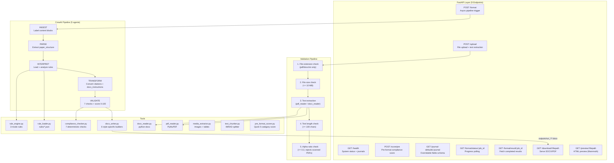

# Agent Paperpal — Backend

> FastAPI + CrewAI + Google Gemini — 5-agent autonomous manuscript formatting pipeline.

The backend accepts research paper uploads (PDF/DOCX/TXT), runs a 5-agent CrewAI pipeline that detects and fixes formatting violations, writes the formatted DOCX output using style-specific builders, and returns a scored compliance report. All formatting jobs run asynchronously as background tasks with real-time progress polling. Supports 3 formatting modes: standard (journal defaults), semi-custom (user overrides), and full-custom (upload guidelines PDF).

---

## Table of Contents

- [Architecture Overview](#architecture-overview)
- [Agent Pipeline](#agent-pipeline)
- [Directory Structure](#directory-structure)
- [Technology Stack](#technology-stack)
- [API Reference](#api-reference)
- [Installation](#installation)
- [Environment Variables](#environment-variables)
- [Running the Server](#running-the-server)
- [Input Validation](#input-validation)
- [Error Handling](#error-handling)
- [Formatting Modes](#formatting-modes)
- [DOCX Builders](#docx-builders)
- [Compliance Report Schema](#compliance-report-schema)
- [Journal Rules Schema](#journal-rules-schema)
- [Performance & Caching](#performance--caching)
- [In-Memory Stores](#in-memory-stores)
- [Security](#security)
- [Testing](#testing)
- [Deployment](#deployment)

---

## Architecture Overview



---

## Agent Pipeline

The pipeline is a **sequential CrewAI `Crew`** — each agent receives context from prior agents via `Task.context`. All agents use `temperature=0` for deterministic output. All JSON is extracted using `extract_json_from_llm()` which implements 8 fallback strategies (markdown fences, balanced brackets, trailing commas, Python literals, single quotes, etc.).

Before the pipeline runs, `_build_structured_paper()` uses `text_chunker.split_into_sections()` to pre-label the paper with IMRAD section delimiters (`[SECTION: NAME]` markers). A `_build_section_rules_guide()` generates a human-readable per-section formatting guide injected into the Transform agent's prompt.

Progress is reported via a callback function that updates `JOB_STORE` — the frontend polls `/format/status/{job_id}` every 2 seconds.

### Agent 1 — INGEST

**Role**: Academic Document Structure Analyst

**Goal**: Label every structural block in the raw text with type markers.

**Output format**: Plain text with markers:
```
[TITLE_START] Deep Learning for Medical Imaging [TITLE_END]
[ABSTRACT_START] This paper presents... [ABSTRACT_END]
[HEADING_H1:Introduction]
[CITATION:Smith et al., 2021]
[REFERENCE_START] Smith, J. et al. (2021). ... [REFERENCE_END]
[CITATION_STYLE:author-date]
[SOURCE_FORMAT:APA]
```

**Supported markers**: `TITLE`, `AUTHORS`, `ABSTRACT`, `KEYWORDS`, `HEADING_H1`-`H3`, `FIGURE_CAPTION`, `TABLE_CAPTION`, `CITATION`, `REFERENCE`, `CITATION_STYLE`, `SOURCE_FORMAT`

**Validation**: At least one structural label must be present.

---

### Agent 2 — PARSE

**Role**: Academic Paper Structure Parser

**Goal**: Convert labelled content into a structured `paper_structure` JSON.

**Output schema**:
```json
{
  "metadata": { "citation_style": "author-date", "source_format": "APA", "paper_type": "research" },
  "title": "string",
  "authors": [{ "name": "string", "affiliations": ["string"], "is_corresponding": false, "email": null }],
  "affiliations": [{ "key": "1", "institution": "string", "address": "string" }],
  "abstract": { "text": "string", "word_count": 250, "has_explicit_label": true },
  "keywords": ["keyword1", "keyword2"],
  "sections": [{
    "heading": "Introduction",
    "level": 1,
    "content": "full paragraph text...",
    "subsections": [{ "heading": "Background", "level": 2, "content": "..." }]
  }],
  "figures": [{ "number": 1, "caption": "Figure 1. Caption text." }],
  "tables": [{ "number": 1, "caption": "Table 1. Caption text." }],
  "citations": [{ "id": "c1", "original_text": "(Smith, 2020)", "context": "surrounding text", "in_text_format": "author-date" }],
  "references": [{
    "id": "r1",
    "original_text": "Smith, J. (2020). Title. Journal, 1(2), 3-4.",
    "parsed": { "authors": "Smith, J.", "year": "2020", "title": "...", "journal": "...", "volume": "1", "issue": "2", "pages": "3-4", "doi": null }
  }],
  "acknowledgments": "text or null",
  "author_contributions": "text or null",
  "journal_metadata": { "journal": null, "volume": null, "doi": null }
}
```

**Validation**: All 11 required top-level keys present; sections must be non-empty.

---

### Agent 3 — INTERPRET

**Role**: Journal Formatting Rules Analyst

**Goal**: Load journal rules from disk (or extract from URL for custom journals), analyze critical formatting requirements.

**Tools**:
- `load_journal_rules()` — cached disk read from `rules/*.json`
- `extract_journal_rules_from_url()` — live URL extraction via BeautifulSoup

**Modes** (via `RuleEngine`):
- **Standard**: Load default rules from `rules/*.json`
- **Semi-Custom**: Load defaults, then apply user overrides
- **Full-Custom**: Extract rules from uploaded guidelines PDF via LLM

**Output**: Enriched rules dictionary (original 11 keys + `critical_checks` + `style_summary`)

**Validation**: All 11 required rule keys present.

---

### Agent 4 — TRANSFORM

**Role**: Academic Document Formatter

**Goal**: Two-phase processing — compare paper structure vs journal rules, then apply fixes.

**Phase A — Violation Scan**:
Checks abstract word count, heading case, citation format, reference ordering, figure/table captions.

**Phase B — Transformation**:
- Converts citations between styles (e.g., numbered `[1]` to author-date `(Smith et al., 2020)`)
- Converts references between formats (e.g., NLM to APA)
- Produces `docx_instructions` for the DOCX writer

**Citation conversion examples** (APA):
- 1 author: `(Smith, 2020)`
- 2 authors: `(Smith & Jones, 2020)`
- 3+ authors: `(Smith et al., 2020)`
- Multiple: `(Smith, 2020; Jones & Brown, 2019)`

**Style-specific prompts**: Each journal (APA, IEEE, Springer, Chicago, Vancouver) gets tailored prompt instructions with exact formatting requirements.

**Output schema**:
```json
{
  "violations": [{ "type": "citations", "description": "...", "severity": "high" }],
  "changes_made": ["Converted all citations to author-date format", "..."],
  "citation_replacements": { "[1]": "(Smith, 2020)", "[2]": "(Jones et al., 2019)" },
  "reference_conversions": [{ "id": "r1", "original_text": "...", "converted_text": "..." }],
  "docx_instructions": {
    "font": "Times New Roman",
    "font_size_halfpoints": 24,
    "line_spacing_twips": 480,
    "margins": { "top": "1in", "bottom": "1in", "left": "1in", "right": "1in" },
    "sections": [
      { "type": "title_page", "content": "..." },
      { "type": "abstract_page", "content": "..." },
      { "type": "body", "content": "..." },
      { "type": "references_page", "content": "..." }
    ]
  }
}
```

**Validation**: `docx_instructions.sections` must be non-empty.

---

### Agent 5 — VALIDATE

**Role**: Academic Compliance Scorer

**Goal**: Run 7 mandatory compliance checks and produce a `compliance_report` with per-section scores 0-100.

**7 LLM Compliance Checks** (weighted):
1. Citations (25%): author-date format, & vs "and", et al. usage
2. References (25%): APA format, alphabetical order, hanging indent, complete metadata
3. Headings (15%): H1-H5 styles, IMRAD presence, correct case/bold/italic
4. Document Format (10%): font, spacing, margins, alignment
5. Abstract (10%): word count, label style, keywords
6. Figures (7.5%): label format, caption position, sequential numbering
7. Tables (7.5%): label format, caption position, sequential numbering

**7 Deterministic Checks** (Python-exact, override LLM scores):
1. Abstract word count — exact count vs `max_words`
2. Citation format match — regex pattern match
3. Reference ordering — alphabetical sort check
4. Citation-reference consistency — bi-directional cross-check
5. DOI format — must use `https://doi.org/xxxxx`
6. et al. period — must be "et al." with period
7. Ampersand in parenthetical citations — `&` not "and"

**Scoring**: Weighted formula across 7 sections. `_clamp_score()` enforces [0, 100] bounds. `_recompute_overall_score()` cross-checks the weighted average. Score >= 80 sets `submission_ready: true`.

---

## Directory Structure

```
backend/
│
├── agents/                         # CrewAI agent factory functions
│   ├── __init__.py                 # Exports create_*_agent() for all 5 agents
│   ├── ingest_agent.py             # Agent 1: Structural labeling with markers
│   ├── parse_agent.py              # Agent 2: JSON structure extraction
│   ├── interpret_agent.py          # Agent 3: Rule loading + analysis
│   ├── transform_agent.py          # Agent 4: Citation conversion + docx_instructions
│   └── validate_agent.py           # Agent 5: 7-check compliance scoring
│
├── engine/                         # Formatting engine
│   ├── format_engine.py            # FormatEngine class: nested rules accessor
│   └── rule_engine.py              # RuleEngine: 3-mode rule generation (standard/semi/full)
│
├── tools/                          # Shared utility tools
│   ├── pdf_reader.py               # PDF extraction: scan detection, header stripping, garble check
│   ├── docx_reader.py              # DOCX extraction: plain text + structured (styles, bold, italic)
│   ├── docx_writer.py              # 6 DOCX builders (APA, IEEE, Springer, Chicago, Vancouver, Generic)
│   ├── rule_loader.py              # Journal rules JSON loader + JOURNAL_MAP + cache
│   ├── rule_extractor.py           # URL-based journal rule extraction (BeautifulSoup)
│   ├── text_chunker.py             # IMRAD section splitter + word count stats
│   ├── compliance_checker.py       # 7 deterministic checks (non-LLM, override LLM scores)
│   ├── media_extractor.py          # Side-channel image/table extraction (PDF/DOCX)
│   ├── pre_format_scorer.py        # Quick pre-pipeline compliance scoring (5 categories)
│   ├── logger.py                   # get_logger(name) → structured logging
│   └── tool_errors.py              # 7 exception types: ToolError, ParseError, LLMResponseError, etc.
│
├── schemas/                        # JSON validation schemas
│   └── rules_schema.json           # Schema for journal rules files
│
├── rules/                          # Journal formatting rule files
│   ├── apa7.json                   # APA 7th Edition (author-date, double-spaced, Title Case)
│   ├── ieee.json                   # IEEE (numbered, 2-column, 10pt)
│   ├── vancouver.json              # Vancouver / ICMJE (numbered, superscript)
│   ├── springer.json               # Springer Nature (numbered, 10pt, single-spaced)
│   └── chicago.json                # Chicago 17th Edition (author-date or notes)
│
├── outputs/                        # Per-run output folders
│   └── run_<id>/                   # Auto-cleaned after 6 hours
│       ├── 1_ingest.txt            # Raw INGEST agent output
│       ├── 2_parse.txt             # Raw PARSE agent output
│       ├── 3_transform.txt         # Raw TRANSFORM agent output
│       ├── 4_validate.txt          # Raw VALIDATE agent output
│       ├── formatted_<id>.docx     # Generated DOCX file
│       └── formatted_<id>.pdf      # Optional PDF (if LibreOffice available)
│
├── uploads/                        # Temporary upload directory (1h TTL)
├── crew.py                         # run_pipeline(): orchestration, caching, JSON extraction, step timing
├── main.py                         # FastAPI app: 9 endpoints, validation, DOC_STORE, JOB_STORE
├── requirements.txt                # Python dependencies
├── .env.example                    # Environment variable template
└── .env                            # Runtime secrets (not committed)
```

---

## Technology Stack

| Technology | Version | Purpose |
|-----------|---------|---------|
| Python | 3.11+ | Primary language |
| FastAPI | 0.111.0 | Async HTTP framework |
| Uvicorn | 0.29.0 | ASGI server |
| CrewAI | >=0.36.0 | Multi-agent orchestration |
| LiteLLM | (via CrewAI) | Gemini API adapter |
| Google Gemini | 2.5 Flash | LLM powering all 5 agents (temperature=0) |
| PyMuPDF (fitz) | >=1.24.0 | PDF text + image extraction |
| python-docx | 1.1.0 | DOCX read, write, in-place transform |
| pdfplumber | >=0.10.0 | PDF table extraction |
| Mammoth | >=1.6.0 | DOCX-to-HTML preview conversion |
| BeautifulSoup4 | >=4.12.0 | HTML parsing for URL rule extraction |
| jsonschema | >=4.0.0 | JSON schema validation |
| python-dotenv | >=1.0.0 | Environment variable loading |
| python-multipart | 0.0.9 | Multipart file upload parsing |

---

## API Reference

### GET /health

Returns system status, supported journals, uptime, and storage diagnostics.

**Response 200:**
```json
{
  "status": "ok",
  "version": "1.0.0",
  "service": "Agent Paperpal",
  "supported_journals": ["APA 7th Edition", "IEEE", "Vancouver", "Springer", "Chicago 17th Edition"],
  "max_file_size_mb": 10,
  "system_info": {
    "python_version": "3.11.0",
    "crewai_version": "0.36.0",
    "api_uptime_seconds": 142.3
  },
  "diagnostics": {
    "rules_folder_exists": true,
    "outputs_folder_writable": true
  }
}
```

---

### POST /upload

Upload a file, extract text, and reserve a `doc_id` for subsequent operations.

**Content-Type**: `multipart/form-data`

| Field | Type | Required | Constraints |
|-------|------|----------|------------|
| `file` | File | Yes | PDF, DOCX, or TXT; max 10 MB |

**Response 200:**
```json
{
  "success": true,
  "doc_id": "a1b2c3d4",
  "filename": "paper.pdf",
  "file_type": "pdf",
  "char_count": 45230,
  "word_count": 7540,
  "preview": "First 200 characters of extracted text...",
  "size_kb": 234.5
}
```

**Errors**: 413 (file too large), 422 (bad extension, no readable text, garbled text)

---

### POST /score/pre

Quick pre-format compliance score (runs without the full pipeline).

**Content-Type**: `multipart/form-data`

| Field | Type | Required | Description |
|-------|------|----------|-------------|
| `doc_id` | String | Yes | Document ID from `/upload` |
| `journal` | String | Yes | Target journal name |
| `mode` | String | No | `standard`, `semi_custom`, or `full_custom` |
| `overrides` | JSON String | No | User overrides (semi-custom mode) |
| `custom_rules` | JSON String | No | Custom rules (full-custom mode) |

**Response 200:**
```json
{
  "success": true,
  "doc_id": "a1b2c3d4",
  "journal": "APA 7th Edition",
  "pre_format_score": {
    "total_score": 62,
    "breakdown": {
      "abstract": { "score": 70, "details": "Abstract label found" },
      "headings": { "score": 55, "details": "IMRAD partially present" },
      "citations": { "score": 80, "details": "Author-date format detected" },
      "references": { "score": 50, "details": "Reference list found" },
      "document": { "score": 60, "details": "Standard formatting" }
    }
  }
}
```

---

### GET /journal-defaults/{journal}

Fetch the overridable field schema for semi-custom mode.

**Response 200:**
```json
{
  "journal": "APA 7th Edition",
  "overridable_fields": {
    "document.font_size": { "label": "Font Size", "type": "select", "values": [8, 9, 10, 11, 12, 14, 16] },
    "abstract.max_words": { "label": "Max Abstract Words", "type": "number", "min": 50, "max": 1000 },
    "document.line_spacing": { "label": "Line Spacing", "type": "select", "values": [1.0, 1.15, 1.5, 2.0] }
  }
}
```

---

### POST /format

Trigger the async CrewAI pipeline. Returns immediately with a `job_id` for polling.

**Content-Type**: `multipart/form-data`

| Field | Type | Required | Description |
|-------|------|----------|-------------|
| `doc_id` | String | Yes (or `file`) | Document ID from `/upload` |
| `file` | File | Yes (or `doc_id`) | Direct file upload (alternative) |
| `journal` | String | Yes | Target journal name |
| `mode` | String | No | `standard`, `semi_custom`, or `full_custom` |
| `overrides` | JSON String | No | User overrides (semi-custom) |
| `custom_rules` | JSON String | No | Custom rules (full-custom) |
| `guideline_pdf` | File | No | Guidelines PDF (full-custom) |

**Response 202:**
```json
{
  "success": true,
  "job_id": "a1b2c3d4",
  "status": "processing",
  "poll_url": "/format/status/a1b2c3d4",
  "message": "Pipeline started. Poll /format/status/a1b2c3d4 for progress."
}
```

---

### GET /format/status/{job_id}

Poll pipeline progress. Recommended interval: 2 seconds.

**Response (processing):**
```json
{
  "status": "processing",
  "progress": 45,
  "step": "TRANSFORM",
  "step_index": 3,
  "total_steps": 5,
  "elapsed_seconds": 28.4
}
```

**Response (done):**
```json
{ "status": "done", "progress": 100 }
```

**Response (error):**
```json
{ "status": "error", "error": "Pipeline error message" }
```

**Headers**: `Cache-Control: no-store` (fresh data every request)

---

### GET /format/result/{job_id}

Fetch completed pipeline results.

**Response 200:**
```json
{
  "success": true,
  "download_url": "/download/run_a1b2c3d4/formatted_a1b2c3d4.docx",
  "compliance_report": {
    "overall_score": 85,
    "submission_ready": true,
    "breakdown": {
      "citations": { "score": 90, "issues": [] },
      "references": { "score": 85, "issues": ["2 references missing DOI"] },
      "headings": { "score": 80, "issues": [] },
      "document_format": { "score": 95, "issues": [] },
      "abstract": { "score": 70, "issues": ["Word count 312 exceeds 250 limit"] },
      "figures": { "score": 100, "issues": [] },
      "tables": { "score": 100, "issues": [] }
    },
    "warnings": ["Abstract exceeds word limit by 62 words"],
    "summary": "Manuscript meets APA requirements with minor issues."
  },
  "changes_made": [
    { "what": "Converted 14 citations to author-date format", "rule_reference": "APA 7th §8.11", "why": "Required by APA" }
  ],
  "processing_time_seconds": 47.3,
  "fidelity_warnings": ["PDF source: figures and tables may not be preserved"]
}
```

**Status codes**: 200 (done), 202 (still processing), 422 (pipeline error)

---

### GET /download/{filepath}

Serve a formatted DOCX or PDF file.

| Parameter | Description |
|-----------|-------------|
| `filepath` | Path within `outputs/` (e.g., `run_abc123/formatted_abc123.docx`) |
| `format` | Query param: `docx` (default) or `pdf` |

**Response 200**: Binary file with `Content-Disposition: attachment`

**Security**: Regex validation + path prefix check confines to `outputs/` directory.

---

### GET /preview/{filepath}

HTML preview of a formatted DOCX file (rendered via Mammoth library).

**Response 200**: Full HTML document with column layout support (e.g., IEEE 2-column).

---

## Installation

### Prerequisites

- Python 3.11 or higher
- `pip` (Python package manager)
- A Google Gemini API key (free at [Google AI Studio](https://aistudio.google.com))

### Steps

```bash
cd backend
python3 -m venv venv
source venv/bin/activate       # Windows: venv\Scripts\activate
pip install -r requirements.txt
cp .env.example .env
# Edit .env and set GEMINI_API_KEY=your-key-here
```

---

## Environment Variables

| Variable | Required | Default | Description |
|----------|----------|---------|-------------|
| `GEMINI_API_KEY` | Yes | — | Google Gemini API key |
| `GOOGLE_API_KEY` | Yes | — | Same key (LiteLLM reads this alias) |
| `GEMINI_MODEL` | No | `gemini-2.5-flash` | Gemini model identifier |
| `GEMINI_MAX_TOKENS` | No | `65536` | Max tokens per LLM call |
| `CORS_ORIGINS` | No | `http://localhost:5173,http://localhost:3000` | Comma-separated allowed CORS origins |
| `BACKEND_HOST` | No | `0.0.0.0` | Uvicorn bind host |
| `BACKEND_PORT` | No | `8000` | Uvicorn bind port |
| `LLM_TIMEOUT` | No | `60` | LLM call timeout in seconds |
| `LLM_MAX_RETRIES` | No | `3` | LLM retry count on failure |

---

## Running the Server

### Development (hot-reload)

```bash
cd backend
source venv/bin/activate
uvicorn main:app --reload --port 8000
```

### Production

```bash
uvicorn main:app --host 0.0.0.0 --port 8000 --workers 2
```

### Verify

```bash
curl http://localhost:8000/health
```

### Startup Logs

```
==================================================
Agent Paperpal API starting up
Supported journals: ['APA 7th Edition', 'IEEE', 'Vancouver', 'Springer', 'Chicago 17th Edition']
Upload dir:  /path/to/backend/uploads
Output dir:  /path/to/backend/outputs
GEMINI_API_KEY: set
==================================================
```

---

## Input Validation

The `/upload` endpoint enforces 5 sequential guards:

| Guard | Check | HTTP Status |
|-------|-------|------------|
| 1. Extension | File must be `.pdf`, `.docx`, or `.txt` | 422 |
| 2. File size | Must be <= 10 MB | 413 |
| 3. Text extraction | PDF/DOCX/TXT text extraction must succeed | 422 |
| 4. Text length | Extracted text must be >= 100 chars | 422 |
| 5. Alpha ratio | >= 30% alphabetic characters (rejects scanned/image-only PDFs) | 422 |

The `/format` endpoint additionally validates:
- Journal name must be a key in `JOURNAL_MAP`
- `doc_id` must exist in `DOC_STORE` (or `file` must be provided)
- Overrides (if provided) must match the allowlist schema

All error responses include `{ "success": false, "error": "...", "step": "..." }`.

---

## Error Handling

### Exception Hierarchy (`tools/tool_errors.py`)

```
ToolError (base)
├── FileProcessingError  — file I/O or extraction failed
├── ExtractionError      — text extraction returned no usable content
├── ParseError           — paper structure too short or unparseable
├── LLMResponseError     — Gemini returned invalid/empty JSON
├── TransformError       — transform agent failed or missing docx_instructions
├── ValidationError      — validate agent failed or missing overall_score
├── RuleLoadError        — journal rules file not found
└── DocumentWriteError   — DOCX file write failed
```

Each exception maps to a specific HTTP status and `step` field for contextual frontend error messages.

A global `@app.exception_handler(Exception)` catches unhandled exceptions and returns a sanitized 500 response — stack traces are never exposed to clients.

---

## Formatting Modes

| Mode | Description | Rule Source |
|------|-------------|-------------|
| `standard` | Use journal defaults as-is | `rules/*.json` |
| `semi_custom` | Override specific fields (13 overridable fields) | `rules/*.json` + user overrides merged via `RuleEngine` |
| `full_custom` | Upload a guidelines PDF — LLM extracts rules | Uploaded PDF → LLM extraction → validated rules dict |

### Semi-Custom Overridable Fields

| Field | Type | Values |
|-------|------|--------|
| `abstract.max_words` | Number | 50-1000 |
| `document.font` | Select | Times New Roman, Arial, Calibri, Georgia |
| `document.font_size` | Select | 8-16pt |
| `document.line_spacing` | Select | 1.0, 1.15, 1.5, 2.0 |
| `document.alignment` | Select | left, justify, center, right |
| `document.margins.top` | Select | 0.5in-2in |
| `document.margins.bottom` | Select | 0.5in-2in |
| `document.margins.left` | Select | 0.5in-2in |
| `document.margins.right` | Select | 0.5in-2in |
| `headings.numbering_style` | Select | roman, numeric, alpha |
| `references.style` | Select | ieee, apa, mla, chicago, vancouver |
| `figures.caption_position` | Toggle | above, below |
| `tables.caption_position` | Toggle | above, below |

---

## DOCX Builders

The `tools/docx_writer.py` module contains 6 style-specific DOCX builders, each implementing the exact formatting requirements of its target journal:

| Builder | Journal | Key Features |
|---------|---------|-------------|
| `build_apa_docx()` | APA 7th Edition | Page-based (title page, abstract page, body, references), double-spaced, hanging indent, H1-H5 hierarchy, running header |
| `build_ieee_docx()` | IEEE | 2-column layout, 10pt font, single-spaced, numbered citations, conference header |
| `build_springer_docx()` | Springer Nature | 10pt, single-spaced, justified, hierarchical numbered headings |
| `build_chicago_docx()` | Chicago 17th | 12pt, double-spaced, left-aligned, un-numbered headings |
| `build_vancouver_docx()` | Vancouver / ICMJE | 12pt, double-spaced, left-aligned, UPPERCASE H1 headings |
| `write_formatted_docx()` | Generic | Rules-driven generic builder for unknown styles |

Additionally, `transform_docx_in_place()` modifies an existing DOCX file in-place (used when input is DOCX, preserving figures/tables/equations).

---

## Compliance Report Schema

```json
{
  "overall_score": 85,
  "submission_ready": true,
  "breakdown": {
    "citations": { "score": 90, "issues": [] },
    "references": { "score": 85, "issues": ["2 references missing DOI"] },
    "headings": { "score": 80, "issues": [] },
    "document_format": { "score": 95, "issues": [] },
    "abstract": { "score": 70, "issues": ["Word count exceeds limit"] },
    "figures": { "score": 100, "issues": [] },
    "tables": { "score": 100, "issues": [] }
  },
  "changes_made": [
    { "what": "Converted citations", "rule_reference": "APA 7th §8.11", "why": "Required" }
  ],
  "warnings": ["Abstract exceeds word limit"],
  "summary": "Manuscript meets APA requirements with minor issues."
}
```

**Score thresholds:**

| Score | Label | `submission_ready` |
|-------|-------|-------------------|
| >= 90 | Excellent compliance | true |
| >= 80 | Good — minor issues | true |
| >= 70 | Good — issues remain | false |
| < 70 | Needs improvement | false |

---

## Journal Rules Schema

Each `rules/*.json` file follows this structure:

```json
{
  "style_name": "APA 7th Edition",
  "document": { "font": "Times New Roman", "font_size": 12, "line_spacing": 2.0, "margins": {...}, "alignment": "left", "columns": 1 },
  "title_page": { "title_case": "Title Case", "title_bold": true, "title_centered": true },
  "abstract": { "label": "Abstract", "max_words": 250, "keywords_present": true, "keywords_italic": true },
  "headings": { "H1": { "bold": true, "centered": true, "case": "Title Case" }, "H2": {...}, "H3": {...} },
  "citations": { "style": "author-date", "format_one_author": "(Smith, 2020)", "et_al_threshold": 3 },
  "references": { "ordering": "alphabetical", "hanging_indent": true, "format": "Author, F. M. (Year). Title..." },
  "figures": { "caption_position": "below", "label_bold": true },
  "tables": { "caption_position": "above", "label_bold": true },
  "equations": { "numbering": "right-aligned" },
  "general_rules": { "doi_format": "https://doi.org/xxxxx", "et_al_threshold": 3, "use_ampersand_in_citations": true }
}
```

**Adding a new journal**: Create a new `rules/<name>.json` file and add its key to `JOURNAL_MAP` in `tools/rule_loader.py`.

---

## Performance & Caching

### Pipeline Cache

Identical submissions (same paper content + journal + mode) are served from an in-memory SHA-256 keyed dictionary:

```python
cache_key = hashlib.sha256(f"{journal}::{paper_text}".encode()).hexdigest()
```

Cache persists for the lifetime of the Uvicorn process.

### Content Truncation

Papers exceeding 32,000 characters are truncated:
- First 24,000 chars (document body)
- Last 8,000 chars (references section)
- Separated by a `[... CONTENT TRUNCATED ...]` marker

### Stage Timing

The `_StepTimer` callback logs wall-clock time per pipeline step and invokes the progress callback:
```
[PIPELINE] Step 1/5 — INGEST     completed in 9.24s
[PIPELINE] Step 2/5 — PARSE      completed in 11.42s
[PIPELINE] Step 3/5 — INTERPRET  completed in 1.83s
[PIPELINE] Step 4/5 — TRANSFORM  completed in 14.61s
[PIPELINE] Step 5/5 — VALIDATE   completed in 10.07s
```

### Robust JSON Extraction

`extract_json_from_llm()` implements 8 fallback strategies for parsing LLM output:
1. Direct `json.loads()`
2. Strip markdown code fences
3. Find largest balanced-bracket JSON block
4. Handle trailing commas
5. Handle Python literal syntax (True/False/None)
6. Handle single quotes
7. Extract from Gemini reasoning blocks
8. Regex-based key-value extraction

---

## In-Memory Stores

### DOC_STORE (document metadata)

```python
DOC_STORE = {
    "doc_id_hex8": {
        "text": "extracted text",
        "ext": "pdf",
        "filename": "original.pdf",
        "upload_path": "/path/to/uploads/doc_id_filename",
        "size_kb": 123.4,
        "created_at": timestamp  # Auto-cleaned after 1 hour
    }
}
```

### JOB_STORE (pipeline jobs)

```python
JOB_STORE = {
    "job_id_hex8": {
        "status": "processing",  # processing | done | error
        "progress": 45,          # 0-100
        "step_index": 3,
        "step_name": "TRANSFORM",
        "created_at": timestamp,
        "result": {...},         # Set when status=done
        "error": "..."           # Set when status=error
    }
}
```

### Other Caches

- **PIPELINE_CACHE**: `{ sha256_hash: pipeline_result }` — in `crew.py`
- **_RULE_CACHE**: `{ filename: parsed_rules_dict }` — in `tools/rule_loader.py`
- **_RULE_ENGINE_CACHE**: `{ journal_name: rules }` — in `agents/interpret_agent.py`

---

## Security

| Concern | Implementation |
|---------|---------------|
| Path traversal | Filename regex + resolved path must start with `outputs/` |
| Upload injection | Extension whitelist, content extracted to temp file |
| Stack trace exposure | Global exception handler returns generic messages |
| Secrets | `.env` file, never committed. `.gitignore` includes `.env` |
| File cleanup | Upload files auto-expire after 1 hour |
| Old output cleanup | `outputs/run_*` folders older than 6 hours deleted on startup |
| CORS | Configurable whitelist, defaults to `localhost` only |
| Input sanitization | Filename sanitized with regex before disk write |
| Job ID validation | `^[a-f0-9]{8}$` regex on all job/doc ID lookups |

---

## Testing

### Manual Testing

```bash
# Health check
curl http://localhost:8000/health

# Upload a paper
curl -X POST http://localhost:8000/upload -F "file=@paper.pdf"

# Pre-format score
curl -X POST http://localhost:8000/score/pre \
  -F "doc_id=a1b2c3d4" \
  -F "journal=APA 7th Edition"

# Format (async)
curl -X POST http://localhost:8000/format \
  -F "doc_id=a1b2c3d4" \
  -F "journal=APA 7th Edition"

# Poll status
curl http://localhost:8000/format/status/a1b2c3d4

# Get result
curl http://localhost:8000/format/result/a1b2c3d4

# Download
curl -O http://localhost:8000/download/run_a1b2c3d4/formatted_a1b2c3d4.docx
```

### Test Scenarios

| Scenario | Expected |
|----------|---------|
| Upload unsupported file (`.jpg`) | 422, step: validation |
| Upload unknown journal | 422, step: validation |
| Upload file > 10 MB | 413 |
| Upload scanned PDF | 422, step: extraction |
| Upload valid PDF + valid journal | 202, job_id present |
| Poll non-existent job | 404 |
| Download with path traversal | 400, invalid filename |
| Duplicate submission (cache hit) | 200, instant |

---

## Deployment

### Docker

```dockerfile
FROM python:3.11-slim

WORKDIR /app
COPY requirements.txt .
RUN pip install --no-cache-dir -r requirements.txt

COPY . .
RUN mkdir -p uploads outputs

EXPOSE 8000
CMD ["uvicorn", "main:app", "--host", "0.0.0.0", "--port", "8000"]
```

```bash
docker build -t agent-paperpal-backend .
docker run -p 8000:8000 \
  -e GEMINI_API_KEY=your-key \
  -e GOOGLE_API_KEY=your-key \
  agent-paperpal-backend
```

### Deployment Checklist

- [ ] `GEMINI_API_KEY` set in production environment
- [ ] `CORS_ORIGINS` updated to production frontend URL
- [ ] `outputs/` directory is writable
- [ ] `rules/` directory contains all 5 JSON files
- [ ] `.env` file is NOT included in Docker image

---

*Backend — Agent Paperpal · HackaMined 2026*
