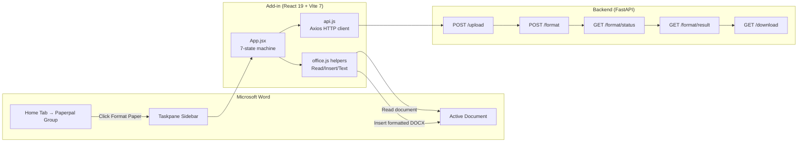

# Agent Paperpal — Microsoft Word Add-in

> Office.js taskpane sidebar — format your manuscript to any journal style without leaving Word.

The Word Add-in is a React-based taskpane that runs inside Microsoft Word (Online, Windows, Mac). It reads the active document via Office.js, sends it to the Agent Paperpal backend for autonomous formatting, displays real-time progress with orbital animations, shows a compliance score breakdown, and can apply the formatted result directly back into the document — all from the Word sidebar.

---

## Table of Contents

- [Architecture](#architecture)
- [Directory Structure](#directory-structure)
- [Technology Stack](#technology-stack)
- [Components](#components)
- [Add-in Flow](#add-in-flow)
- [API Integration](#api-integration)
- [Office.js Integration](#officejs-integration)
- [HTTPS & Certificates](#https--certificates)
- [Installation](#installation)
- [Sideloading the Add-in](#sideloading-the-add-in)
- [Environment Variables](#environment-variables)
- [Running](#running)
- [Build & Deploy](#build--deploy)

---

## Architecture

The add-in is a **React SPA** hosted on an HTTPS server, loaded into Word's taskpane via `manifest.xml`. It communicates with Word through the Office.js API and with the Agent Paperpal backend through HTTP (proxied by Vite in development).



### State Machine

| State | Description |
|-------|-------------|
| `IDLE` | Journal selector visible, waiting for user action |
| `UPLOADING` | Reading document from Word, sending to backend |
| `FORMATTING` | Backend pipeline started |
| `POLLING` | Polling for job completion with progress updates |
| `RESULTS` | Compliance report displayed, action buttons available |
| `APPLYING` | Downloading formatted DOCX and inserting into Word |
| `ERROR` | Error state with retry button |

---

## Directory Structure

```
word-addin/
├── src/
│   ├── components/
│   │   ├── JournalSelector.jsx      # Journal style dropdown (5 journals)
│   │   ├── FormatButton.jsx         # "Format Paper" CTA with gradient + glow
│   │   ├── ProgressBar.jsx          # Orbital animation + typewriter + step indicators
│   │   ├── ComplianceReport.jsx     # Score gauge + section breakdown table
│   │   └── ErrorBanner.jsx          # Red error display with retry button
│   │
│   ├── utils/
│   │   ├── api.js                   # Backend API client (5 endpoints, 2s polling)
│   │   └── office.js                # Office.js helpers (4 functions)
│   │
│   ├── App.jsx                      # Root: 7-state machine, workflow orchestration
│   ├── main.jsx                     # Office.onReady() + React mount
│   └── index.css                    # Design tokens + orbital/typewriter/gauge animations
│
├── public/                          # Add-in icons
│   ├── icon-16.png                  # 16x16 icon (ribbon)
│   ├── icon-32.png                  # 32x32 icon (ribbon)
│   ├── icon-80.png                  # 80x80 icon (ribbon)
│   └── icon-128.png                 # 128x128 icon (store)
│
├── certs/                           # Self-signed SSL certificates
│   ├── localhost.crt                # Certificate (365 days)
│   └── localhost.key                # Private key (RSA 2048-bit)
│
├── dist/                            # Production build output
├── manifest.xml                     # Office Add-in manifest
├── index.html                       # Entry HTML (loads Office.js CDN)
├── package.json                     # Dependencies + scripts
├── vite.config.js                   # HTTPS server + API proxy
├── postcss.config.js                # TailwindCSS PostCSS config
└── .gitignore
```

---

## Technology Stack

| Technology | Version | Purpose |
|-----------|---------|---------|
| React | 19.2.0 | UI framework |
| React DOM | 19.2.0 | DOM rendering |
| Vite | 7.3.1 | HTTPS dev server + production build |
| TailwindCSS | 4.2.1 | Utility-first CSS |
| Axios | 1.13.6 | HTTP client for backend API |
| Office.js | 1.x (CDN) | Word document read/write API |
| office-addin-dev-certs | 2.0.6 | SSL certificate generation (fallback) |
| Autoprefixer | 10.4.27 | CSS vendor prefixes |
| PostCSS | 8.5.6 | CSS processing |

---

## Components

### App.jsx — Root Component

Orchestrates the entire add-in workflow:

1. **Validates** journal selection
2. **Reads** current document via Office.js (streaming 64KB slices)
3. **Validates** document has >= 100 characters
4. **Uploads** document to backend (`POST /upload`)
5. **Starts** formatting job (`POST /format` with journal)
6. **Polls** progress every 2 seconds (`GET /format/status/{job_id}`)
7. **Fetches** results on completion (`GET /format/result/{job_id}`)
8. **Displays** compliance score breakdown
9. **Applies** or **downloads** the formatted document

Key functions:
- `handleFormat()` — Orchestrates upload → format → poll → result cycle
- `handleApply()` — Downloads formatted DOCX, inserts into Word via `insertDocx()`
- `handleDownload()` — Downloads DOCX to browser
- `reset()` — Clears all state, aborts pending requests via AbortController

### JournalSelector.jsx

Dropdown with 5 journal styles:
- APA 7th Edition (blue)
- IEEE (orange)
- Springer (green)
- Vancouver (purple)
- Chicago (amber)

Glass-morphism select with custom arrow icon. Disabled during processing.

### FormatButton.jsx

Large CTA button with orange gradient (`#F97316` → `#EA6C0A`). Hover animation with lift + glow shadow. Disabled when no journal is selected. Optional loading spinner state.

### ProgressBar.jsx

Multi-element progress visualization:
- **Orbital animation**: Central glowing orb with 3 rotating satellites
- **Typewriter text**: Step name animates character-by-character (30ms/char)
- **Progress percentage**: Real-time 0-100%
- **4 step indicators**: Extracting structure → Applying format rules → Validating citations → Generating document
- **Step cards**: Show completed (checkmark), current (highlighted), and pending steps

### ComplianceReport.jsx

- **Score gauge**: Animated SVG circular progress (1s ease-out)
  - Green (#10B981) for >= 80
  - Orange (#F97316) for 60-79
  - Red (#EF4444) for < 60
- **Section breakdown**: Table of per-section compliance scores with staggered row animation
- **Action buttons**: Apply to Document / Download DOCX

### ErrorBanner.jsx

Red background with alert icon. Displays error message (multi-line support). "Try Again" button with hover effect.

---

## Add-in Flow

```
1. User opens a Word document

2. Clicks "Format Paper" button in the Home ribbon (Paperpal group)
   → Opens taskpane sidebar

3. Selects target journal style (APA, IEEE, Springer, Vancouver, Chicago)

4. Clicks "Format Paper" button in the add-in
   → Add-in validates journal selection
   → Reads document via Office.js (getDocumentAsBlob → 64KB slices → Blob)
   → Validates text >= 100 chars (getDocumentText)

5. Uploads DOCX blob to backend (POST /upload → doc_id)

6. Starts formatting pipeline (POST /format with doc_id + journal → job_id)

7. Polls progress every 2 seconds (GET /format/status/{job_id})
   → Orbital animation + typewriter step name
   → Progress: 0-100%
   → 4 step indicators update as pipeline progresses
   → Max 600 polls (20-minute timeout)

8. Fetches result (GET /format/result/{job_id})
   → Displays compliance score gauge
   → Shows per-section breakdown (citations, references, headings, etc.)

9. User chooses:
   a) "Apply to Document"
      → Downloads formatted DOCX (GET /download/{path})
      → Converts to base64
      → Inserts into Word via body.insertFileFromBase64(content, Replace)
      → Document body is replaced in-place
   b) "Download DOCX"
      → Downloads file to browser
   c) "Format Another" → Resets to step 3
```

---

## API Integration

**File**: `src/utils/api.js`

**Base URL**: `import.meta.env.VITE_BACKEND_URL || "/api"` (proxied to `http://localhost:8000` in dev)

| Function | Method | Endpoint | Purpose |
|----------|--------|----------|---------|
| `uploadDocument(blob, filename)` | POST | `/upload` | Upload DOCX blob |
| `startFormat(docId, journal)` | POST | `/format` | Start async pipeline |
| `pollUntilDone(jobId, onProgress, signal)` | GET | `/format/status/{jobId}` | Poll every 2s (max 600 polls) |
| `getResult(jobId)` | GET | `/format/result/{jobId}` | Fetch completed results |
| `downloadDocx(downloadPath)` | GET | `/download/{path}` | Download formatted DOCX |

**Polling**: 2-second interval, abortable via `AbortSignal`, returns on `status === "done"`, throws on `status === "error"`.

**Timeout**: 30 seconds per request.

---

## Office.js Integration

**File**: `src/utils/office.js`

### Functions

| Function | Purpose | API Style |
|----------|---------|-----------|
| `getDocumentAsBlob()` | Read entire document as DOCX Blob (64KB slices) | Callback-based (`getFileAsync`) |
| `getDocumentText()` | Extract plain text from document body | Promise-based (`Word.run`) |
| `insertDocx(base64Content)` | Replace document body with formatted DOCX | Promise-based (`Word.run`) |
| `isOfficeReady()` | Check if Office.js + Word APIs are available | Synchronous check |

### Permissions

The add-in requests `ReadWriteDocument` permission (declared in `manifest.xml`), which allows:
- Reading the full document content
- Replacing the document body with formatted content
- Accessing document properties

### Entry Point (`main.jsx`)

```javascript
Office.onReady(() => {
  ReactDOM.createRoot(document.getElementById("root")).render(<App />);
});
```

Falls back to standalone browser rendering if Office.js is unavailable (for development/testing outside Word).

---

## HTTPS & Certificates

Office Add-ins **require HTTPS**. The dev server runs on `https://localhost:3001`.

### Certificate Setup

**Auto-generated** (preferred):
```bash
npm run certs
# Creates certs/localhost.crt and certs/localhost.key (RSA 2048-bit, 365 days)
```

**Fallback chain** (in `vite.config.js`):
1. Look for `certs/localhost.{crt,key}` → use if found
2. Try `office-addin-dev-certs` library → generate Microsoft-compatible certs
3. Fall back to `https: true` → Vite auto-generates (least compatible)

### Troubleshooting

- **Browser blocks self-signed cert**: Visit `https://localhost:3001` directly and accept the certificate warning
- **Word reports "cannot reach add-in"**: Verify the Vite server is running and HTTPS is enabled
- **Certs expired**: Delete `certs/` folder and run `npm run certs` again

---

## Installation

### Prerequisites

- Node.js 18+
- npm
- Backend running on `http://localhost:8000`
- Microsoft Word (Online, Windows, or Mac) for sideloading

### Steps

```bash
cd word-addin
npm install
npm run certs          # Generate SSL certificates (first time only)
```

---

## Sideloading the Add-in

### Word Online (Recommended for demo)

1. Go to [office.com/launch/word](https://www.office.com/launch/word) and open any document
2. Click **Insert** > **Office Add-ins** > **Upload My Add-in**
3. Browse to `word-addin/manifest.xml` and upload
4. The "Agent Paperpal" taskpane opens in the sidebar

### Windows Desktop

1. Open File Explorer, navigate to `%USERPROFILE%\AppData\Local\Microsoft\Office\16.0\Wef\`
2. Copy `manifest.xml` into that folder
3. Restart Word
4. Find "Agent Paperpal" under **Insert > My Add-ins**

### Mac Desktop

1. Copy `manifest.xml` to `~/Library/Containers/com.microsoft.Word/Data/Documents/wef/`
2. Restart Word
3. Find "Agent Paperpal" under **Insert > My Add-ins**

---

## Environment Variables

| Variable | Required | Default | Description |
|----------|----------|---------|-------------|
| `VITE_BACKEND_URL` | No | `/api` (proxied) | Backend API base URL |

In development, the Vite proxy forwards `/api/*` to `http://localhost:8000/*`.

---

## Running

### Development

```bash
npm run dev              # HTTPS server on https://localhost:3001
```

Make sure the backend is running on `http://localhost:8000`.

### Available Scripts

| Script | Command | Description |
|--------|---------|-------------|
| `npm run dev` | `vite` | Start HTTPS dev server (port 3001) |
| `npm run build` | `vite build` | Production build to `dist/` |
| `npm run preview` | `vite preview` | Preview production build |
| `npm run certs` | `openssl req ...` | Generate self-signed SSL certificates |

---

## Build & Deploy

### Production Build

```bash
npm run build
```

**Output**:
```
dist/
├── index.html
├── assets/
│   ├── index-<hash>.js     # Minified React bundle
│   └── index-<hash>.css    # Minified CSS
├── icon-16.png
├── icon-32.png
├── icon-80.png
└── icon-128.png
```

### Deploying to Production

1. **Build** the React app: `npm run build`
2. **Host** the `dist/` directory on an HTTPS server (Azure, Vercel, GitHub Pages, etc.)
3. **Update** `manifest.xml`:
   - Change `<SourceLocation>` to your production URL
   - Change all `<bt:Image>` URLs to your production domain
4. **Update** `VITE_BACKEND_URL` to the production backend API URL before building
5. **Publish** the updated `manifest.xml`:
   - For organization: Deploy via Microsoft 365 Admin Center
   - For public: Submit to AppSource marketplace
   - For testing: Continue sideloading

### Manifest Checklist

- [ ] `<SourceLocation>` points to production HTTPS URL
- [ ] All icon `<bt:Image>` URLs updated
- [ ] Backend CORS allows the production add-in domain
- [ ] SSL certificate is valid (not self-signed) for production

---

## Design System

### Colors

| Token | Hex | Usage |
|-------|-----|-------|
| `--primary` | `#2563EB` | Secondary accent (blue) |
| `--orange` | `#F97316` | Primary brand color |
| `--success` | `#10B981` | Score >= 80, completed steps |
| `--error` | `#EF4444` | Score < 60, errors |
| `--warning` | `#F59E0B` | Score 60-79, pending |

### Animations

| Animation | Description | Duration |
|-----------|-------------|----------|
| `fadeUp` | Slide up + fade in | 0.5s |
| `orbitDot` | Satellite rotation | 1.4-2.3s |
| `pulseRing` | Expanding ring around orb | 2s |
| `glow` | Pulsing orb glow | 2s |
| `stepFade` | Step card reveal | 0.4s |
| `countUp` | Number counter | 1s |
| `spin` | Loading spinner | 1s |

### Font

**Outfit** (Google Fonts) — modern geometric sans-serif, loaded via `<link>` in `index.html`.

---

*Word Add-in — Agent Paperpal · HackaMined 2026*
